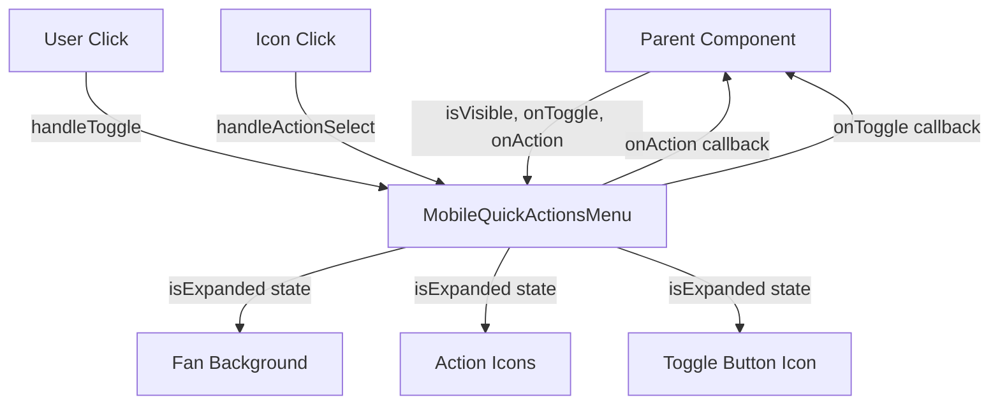

# Mobile Quick Actions Menu - Architecture & Implementation Guide

## Overview

The Mobile Quick Actions Menu is a floating action button (FAB) component designed for mobile devices that provides quick access to debugging tools. When clicked, it expands into a semi-circular fan with 5 action buttons positioned along a curved path.

## Component Architecture

### 1. Component Structure

```
MobileQuickActionsMenu
├── Props Interface (MobileQuickActionsMenuProps)
├── Configuration (quickActions array)
├── State Management (isExpanded)
├── Event Handlers (handleToggle, handleActionSelect)
├── Utility Functions (getActionPosition)
└── JSX Structure
    ├── Main Container
    ├── Fan Background (conditional)
    ├── Action Icons (conditional)
    ├── Toggle Button
    └── CSS Animations
```

### 2. Data Flow



## Key Features

### 1. Semi-Circular Fan Layout

**Mathematical Approach:**
- Uses trigonometry to position icons along a 180-degree arc
- Divides the arc into equal segments (45° between each icon)
- Applies a flattening factor (0.6) for better visual appeal

**Positioning Formula:**
```javascript
const angle = (startAngle + (index * angleStep)) * (Math.PI / 180);
const x = Math.cos(angle) * radius;
const y = -Math.sin(angle) * radius * 0.6;
```

### 2. Staggered Animation System

**Animation Sequence:**
1. **Button Icon Transition**: Menu (☰) → X (✕) in 300ms
2. **Fan Background**: Appears instantly with CSS clip-path
3. **Icon Wave Effect**: Each icon appears with 0.1s delay
   - Icon 1: 0s delay
   - Icon 2: 0.1s delay
   - Icon 3: 0.2s delay
   - Icon 4: 0.3s delay
   - Icon 5: 0.4s delay

**CSS Animation:**
```css
@keyframes fadeInScale {
  0% {
    opacity: 0;
    transform: translate(-50%, -50%) scale(0.3);
  }
  100% {
    opacity: 1;
    transform: translate(-50%, -50%) scale(1);
  }
}
```

### 3. Responsive Design

**Mobile-First Approach:**
- Fixed positioning at bottom center
- Touch-friendly button sizes (64px main button, 40px icons)
- Hover effects for desktop compatibility
- High z-index (50) to stay above other content

## Implementation Details

### 1. State Management

```typescript
const [isExpanded, setIsExpanded] = useState(false);
```

**State Logic:**
- `false`: Fan closed, shows Menu icon
- `true`: Fan open, shows X icon and action buttons

### 2. Event Handling

**Toggle Handler:**
```typescript
const handleToggle = () => {
  setIsExpanded(!isExpanded);
  if (!isExpanded) {
    onToggle(); // Notify parent only when opening
  }
};
```

**Action Selection Handler:**
```typescript
const handleActionSelect = (actionId: string) => {
  onAction(actionId);
  setIsExpanded(false); // Auto-close after selection
};
```

### 3. Positioning System

**Coordinate Calculation:**
```typescript
const getActionPosition = (index: number) => {
  const totalActions = quickActions.length; // 5
  const fanWidth = 240;  // pixels
  const startAngle = 0;  // degrees
  const endAngle = 180;  // degrees
  const angleRange = endAngle - startAngle; // 180°
  const angleStep = angleRange / (totalActions - 1); // 45°
  
  const angle = (startAngle + (index * angleStep)) * (Math.PI / 180);
  const radius = fanWidth / 2; // 120px
  
  return {
    x: Math.cos(angle) * radius,
    y: -Math.sin(angle) * radius * 0.6
  };
};
```

### 4. CSS Styling Strategy

**Fan Background:**
- Uses `clip-path: polygon()` for precise curve control
- Gradient background for visual depth
- Rounded bottom corners for natural appearance

**Icon Positioning:**
- Absolute positioning within relative container
- `calc()` functions for precise coordinate placement
- `transform: translate(-50%, -50%)` for perfect centering

## Available Actions

| Action | Icon | Purpose | Handler |
|--------|------|---------|---------|
| Inspector | 👁️ | Opens element inspector panel | `handleElementClick()` |
| Screenshot | 📷 | Activates screenshot capture mode | `setActiveScreenshotOverlay()` |
| Context | ✨ | Generates AI context for element | `analyzeElementWithAI()` |
| Debug | 🐛 | Opens AI debug modal | `setShowAIDebugModal()` |
| Terminal | 🔍 | Opens debug terminal panel | `setShowTerminalPanel()` |

## Performance Considerations

### 1. Conditional Rendering
- Fan background and icons only render when `isExpanded` is true
- Early return when `isVisible` is false
- Prevents unnecessary DOM elements

### 2. CSS Animations
- Uses CSS transforms for 60fps performance
- Hardware acceleration with `transform` properties
- Minimal JavaScript during animations

### 3. Event Optimization
- Single click handler for toggle button
- Direct function calls for action selection
- No complex state updates during animations

## Accessibility Features

### 1. Keyboard Navigation
- Focusable toggle button
- Proper ARIA labels (can be added)
- Escape key handling (handled by parent)

### 2. Touch Targets
- 64px main button (meets WCAG guidelines)
- 40px action icons (adequate for touch)
- Proper spacing between interactive elements

### 3. Visual Feedback
- Hover states for desktop users
- Active states for touch interactions
- Smooth transitions for state changes

## Integration with Parent Component

### 1. Props Interface
```typescript
interface MobileQuickActionsMenuProps {
  isVisible: boolean;                    // Controls component visibility
  onToggle: () => void;                  // Called when fan opens
  onAction: (action: string) => void;    // Called when action selected
}
```

### 2. Usage in Parent
```typescript
<MobileQuickActionsMenu
  isVisible={isTraceActive}
  onToggle={() => setShowMobileMenu(!showMobileMenu)}
  onAction={handleMobileQuickAction}
/>
```

### 3. Action Handler Integration
```typescript
const handleMobileQuickAction = useCallback((action: string) => {
  switch (action) {
    case 'inspector':
      handleElementClick();
      break;
    case 'screenshot':
      setActiveScreenshotOverlay('rectangle');
      break;
    // ... other cases
  }
}, [dependencies]);
```

## Testing Considerations

### 1. Unit Tests
- Component renders correctly with different prop combinations
- State changes trigger appropriate callbacks
- Position calculations are mathematically correct

### 2. Integration Tests
- Parent component receives correct callbacks
- Actions trigger expected behaviors
- Animation timing is consistent

### 3. Visual Tests
- Fan layout appears correctly on different screen sizes
- Animations are smooth and performant
- Icons are properly positioned along the curve

## Future Enhancements

### 1. Customization Options
- Configurable fan radius and angle
- Customizable animation timing
- Theme support for different color schemes

### 2. Advanced Interactions
- Long press for additional options
- Swipe gestures for quick access
- Haptic feedback on mobile devices

### 3. Performance Optimizations
- Memoization of position calculations
- Lazy loading of icon components
- Reduced bundle size with tree shaking

## Troubleshooting

### Common Issues

1. **Icons Not Positioning Correctly**
   - Check `getActionPosition` calculations
   - Verify CSS `calc()` syntax
   - Ensure proper container dimensions

2. **Animations Not Working**
   - Verify CSS keyframes are defined
   - Check animation timing values
   - Ensure no conflicting transforms

3. **Touch Events Not Responding**
   - Verify z-index is high enough
   - Check for overlapping elements
   - Ensure proper event propagation

### Debug Tools

1. **Browser DevTools**
   - Inspect element positioning
   - Monitor animation performance
   - Check for CSS conflicts

2. **React DevTools**
   - Monitor component state changes
   - Verify prop passing
   - Check re-render frequency

## Conclusion

The Mobile Quick Actions Menu provides an intuitive and performant way to access debugging tools on mobile devices. Its mathematical positioning system, smooth animations, and responsive design create a polished user experience that enhances the overall debugging workflow. 