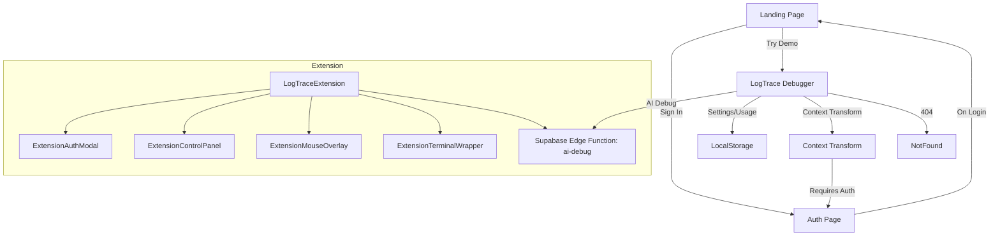

# Trace Sight Debug View – Architecture Map

## 1. Routing & Main Pages

| Route                  | Component/Page         | Purpose/Notes                                                      |
|------------------------|-----------------------|--------------------------------------------------------------------|
| `/`                    | Landing               | Marketing, waitlist signup (Supabase), demo CTA                    |
| `/auth`                | Auth                  | User authentication (email/password, GitHub OAuth via Supabase)    |
| `/debug`               | Index (LogTrace)      | Main LogTrace debugging UI, core of the app                        |
| `/context-transform`   | ContextTransform      | Auth-gated, advanced context transformation tools                  |
| `*`                    | NotFound              | 404 fallback                                                       |
| *(not routed)*         | Index_Userinput_iframe| Demo: load arbitrary site in iframe for debugging                  |

---

## 2. Core Components & Features

### LogTrace (Main Debugger UI)
- **Hooks Used:**
  - `useLogTrace` (composes event tracking, element inspection, debug modal, settings)
  - `useDebugResponses` (AI debug results)
  - `useUsageTracking` (free/premium usage, localStorage)
  - `useToast` (notifications)
- **Subcomponents:**
  - Header, InstructionsCard, MouseOverlay, ElementInspector, DebugModal, TabbedTerminal, SettingsDrawer, UpgradeModal, OnboardingWalkthrough, PinnedDetails, QuickActionModal

### Extension (Chrome Extension)
- **LogTraceExtension**: Chrome extension version of LogTrace, with similar logic but different UI mounting and extension-specific hooks.
- **Extension Components:**
  - ExtensionAuthModal, ExtensionControlPanel, ExtensionMouseOverlay, ExtensionTerminalWrapper
  - `useExtensionAuth` (handles extension-specific auth and guest debug gating)

---

## 3. Hooks & State Management

- **AuthContext**: Provides user/session state, sign in/out/up, GitHub OAuth, loading state
- **useLogTrace**: Manages active state, mouse/element tracking, debug modal, event log, settings
- **useDebugModal**: Handles AI debug modal, calls Supabase Edge Function for AI, manages retries/errors
- **useUsageTracking**: Tracks free/premium AI debug usage (localStorage)
- **useToast**: Notification system
- **Other hooks**: useConsoleLogs, useContextEngine, useElementInspection, useEventTracking, usePinnedDetails, useSettings

---

## 4. Database & Backend (Supabase)

- **Auth**: Email/password, GitHub OAuth
- **Waitlist**: `waitlist` table for early access signups
- **Edge Functions**: `ai-debug` for AI-powered debugging (invoked from frontend)
- **Session/Usage**: Auth state, session, and usage tracked via Supabase and localStorage

---

## 5. Page Connections & Flows

- **Landing**: Links to `/debug` (demo), `/auth` (sign in), and handles waitlist signup
- **Auth**: Redirects to `/` on login, supports extension auth flows
- **Debug**: Main LogTrace UI, only accessible directly (not gated)
- **Context Transform**: Requires auth, redirects to `/auth` if not signed in
- **NotFound**: Catches all other routes
- **Index_Userinput_iframe**: Loads a user-specified site in an iframe for debugging, not in main router

---

## 6. Extension Architecture

- **LogTraceExtension**: Similar to LogTrace, but optimized for Chrome extension context
- **ExtensionAuthModal, ExtensionControlPanel, ExtensionMouseOverlay, ExtensionTerminalWrapper**: Extension-specific UI components
- **useExtensionAuth**: Handles extension-specific auth and guest debug gating

---

## 7. Data Flow Example (Debugging Session)

1. **User visits `/debug`**
2. **LogTrace** mounts, initializes hooks and state
3. User interacts with UI (hover/click elements)
4. **ElementInspector**/MouseOverlay show context
5. User triggers AI debug (via modal or shortcut)
6. **useDebugModal** calls Supabase Edge Function `ai-debug`
7. AI response is shown in DebugModal/TabbedTerminal
8. Usage is tracked (localStorage, Supabase if logged in)

---

## 8. Diagram (Mermaid)

---

*This file is auto-generated to reflect the current architecture and page connections of the Trace Sight Debug View app.* 